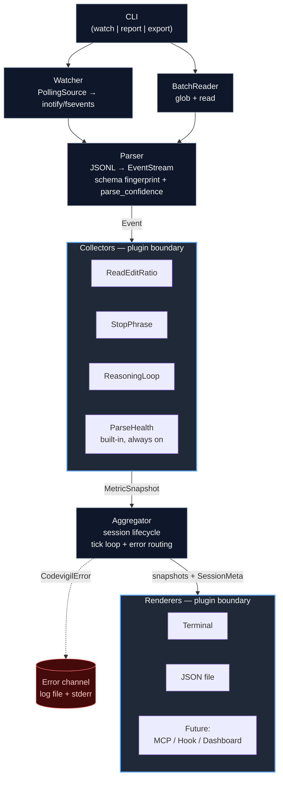

# codevigil — System Design

## Problem

Claude Code session quality degrades silently. Users have no instrumentation to detect, measure, or respond to quality regressions in real-time. The only existing approach (stellaraccident's manual JSONL analysis) required months of logs and significant engineering effort to produce after-the-fact.

codevigil makes session quality observable.

## Non-Goals (v0.1)

- Auto-remediation (hooks that inject corrections)
- Convention drift scoring (requires CLAUDE.md parsing + edit diffing)
- GUI / web dashboard
- Cloud telemetry or any network calls
- Multi-user or team features

## Architecture



### Why This Shape

Two plugin boundaries. Collectors and renderers are the two axes of future expansion. New metric = new collector, no existing code touched. New output target = new renderer, same deal. The parser-to-collector interface (Event) and the collector-to-renderer interface (Snapshot) are the two contracts that need to stay stable.

## Core Abstractions

### Event

The parser's output. Every JSONL entry becomes one or more typed Events. This is the internal lingua franca — collectors never touch raw JSONL.

```python
@dataclass(frozen=True, slots=True)
class Event:
    timestamp: datetime
    session_id: str
    kind: EventKind
    payload: dict[str, Any]

class EventKind(Enum):
    TOOL_CALL = "tool_call"          # any tool invocation
    TOOL_RESULT = "tool_result"      # tool response
    ASSISTANT_MESSAGE = "assistant"  # model text output
    USER_MESSAGE = "user"            # user prompt
    THINKING = "thinking"            # thinking block (content or redacted)
    SYSTEM = "system"                # system/meta events
```

Payload is intentionally unstructured at the type level — each EventKind has an **explicit documented schema** (below) but we don't enforce it with dataclasses to avoid a type explosion as kinds grow. Collectors never reach into `payload` directly; they use the `safe_get` helper in `types.py`:

```python
def safe_get(payload: dict, key: str, default: Any, expected: type | None = None) -> Any:
    """Returns payload[key] if present and type-matches, else default. Logs a WARN
    to the error channel on missing-expected or type-mismatch so drift is observable."""
```

This turns every silent `KeyError` or type mismatch into a counted, reportable event (see **Error Taxonomy**). A collector that starts seeing >5% `safe_get` miss-rate on a required field is a parse-drift signal — surfaced via the `parse_confidence` meta-metric.

#### Payload Schemas by EventKind

| EventKind           | Required keys                                       | Optional keys                                                                                                                                               |
| ------------------- | --------------------------------------------------- | ----------------------------------------------------------------------------------------------------------------------------------------------------------- |
| `TOOL_CALL`         | `tool_name: str`, `tool_use_id: str`, `input: dict` | `file_path: str` (extracted from input when applicable)                                                                                                     |
| `TOOL_RESULT`       | `tool_use_id: str`, `is_error: bool`                | `output: str`, `truncated: bool`                                                                                                                            |
| `ASSISTANT_MESSAGE` | `text: str`                                         | `token_count: int`                                                                                                                                          |
| `USER_MESSAGE`      | `text: str`                                         | —                                                                                                                                                           |
| `THINKING`          | `length: int`                                       | `signature: str`, `redacted: bool`, `text: str` (reserved for v0.2 `thinking_depth` collector; always populated when available, ignored by v0.1 collectors) |
| `SYSTEM`            | `subkind: str`                                      | arbitrary                                                                                                                                                   |

Reserving the `THINKING` payload now (even though v0.1 ships no collector that reads it) avoids a schema migration when `thinking_depth` lands in v0.2.

Trade-off: we lose compile-time payload validation. Acceptable at this scale. If payload diversity grows past ~10 kinds, introduce typed payload dataclasses behind a discriminated union.

### Collector (Protocol)

```python
class Collector(Protocol):
    name: str
    complexity: str  # documented big-O per ingest, e.g. "O(1)" or "O(phrases * text_len)"

    def ingest(self, event: Event) -> None:
        """Process a single event. Must not raise; must not block."""
        ...

    def snapshot(self) -> MetricSnapshot:
        """Return current state. Idempotent and cheap; safe to call at any frequency."""
        ...

    def reset(self) -> None:
        """Clear state. Called ONLY on session boundary transitions (see lifecycle below)."""
        ...
```

Collectors are stateful, single-threaded, and own their windowing logic. The aggregator calls `snapshot()` on a timer or on-demand — collectors don't decide when to report.

#### Lifecycle Contract

`reset()` is called by the aggregator **only** at session boundaries:

1. When a new session file is first observed (fresh collector instance, `reset()` is a no-op but defined for symmetry).
2. When a session is evicted from the active set (see **Stale Session Policy**).
3. Never mid-session. Rolling windows (e.g., `read_edit_ratio`'s 50-event deque) MUST NOT be cleared by `snapshot()` or by tick cadence — doing so would mask the degradation the metric is designed to detect.

Collectors that need per-session state use one instance per session; the aggregator manages the `dict[session_id, dict[collector_name, Collector]]` map.

#### Complexity Honesty

The earlier draft claimed "O(1) amortized" for all collectors. That's false for text-scanning collectors. The real contract:

| Collector         | Per-ingest cost                                                                                                                                     |
| ----------------- | --------------------------------------------------------------------------------------------------------------------------------------------------- |
| `read_edit_ratio` | O(1) — deque append + counter update                                                                                                                |
| `stop_phrase`     | O(P·L) with P = phrase count, L = message length. Switches to Aho–Corasick automaton (stdlib-implementable) once P > 32 to bound to O(L + matches). |
| `reasoning_loop`  | O(P·L) with same escalation rule                                                                                                                    |
| `blind_edit_rate` | O(W) with W = lookback window size (default 20)                                                                                                     |

Document the throughput ceiling in the README: at P=50, L=2000, the naive scan is ~5M char-compares per session of 50 assistant messages — well under a second, but not O(1). The Aho–Corasick escalation is the upgrade path if user phrase lists grow large.

Each collector declares its `name` as a string key. Snapshots are keyed by this name in the aggregated output. Collision is caught at registry load time (see **Registry Validation**), not runtime.

### MetricSnapshot

```python
@dataclass(frozen=True, slots=True)
class MetricSnapshot:
    name: str
    value: float                           # primary scalar (for threshold checks)
    label: str                             # human-readable summary, e.g. "R:E 3.2"
    detail: dict[str, Any] | None = None   # optional structured breakdown
    severity: Severity = Severity.OK

class Severity(Enum):
    OK = "ok"
    WARN = "warn"
    CRITICAL = "critical"
```

`value` is always a float. This is a deliberate constraint — it forces every metric to have a single primary scalar that can be thresholded, trended, and compared. Rich data goes in `detail`.

`severity` is computed by the collector against its own configured thresholds. The renderer uses it for coloring/alerting but doesn't interpret the value itself.

### SessionMeta

```python
@dataclass(frozen=True, slots=True)
class SessionMeta:
    session_id: str          # file stem (see Session Identification)
    project_hash: str        # parent dir name under ~/.claude/projects
    project_name: str | None # resolved via ProjectRegistry; None if unmapped
    file_path: Path
    start_time: datetime     # first event timestamp observed
    last_event_time: datetime
    event_count: int
    parse_confidence: float  # 0.0–1.0, emitted by parser (see Parser Design)
    state: SessionState      # ACTIVE | STALE | EVICTED
```

SessionMeta is produced by the aggregator, not by collectors. It accompanies every render call so renderers never need to reach back into the event stream or filesystem.

### Renderer (Protocol)

```python
class Renderer(Protocol):
    name: str

    def render(self, snapshots: list[MetricSnapshot], meta: SessionMeta) -> None:
        """Output the current state. Called on aggregator tick. Must not raise."""
        ...

    def render_error(self, err: CodevigilError, meta: SessionMeta | None) -> None:
        """Surface an error from parser/watcher/collector. See Error Taxonomy."""
        ...

    def close(self) -> None:
        """Flush any buffered output. Called on CLI exit or session eviction."""
        ...
```

Renderers are stateless w.r.t. metric values but may hold output handles (file descriptors, terminal state). They receive the full snapshot list for a single session on every tick. Multi-session composition is the aggregator's job, not the renderer's — this keeps renderers simple and composable.

Terminal renderer clears and redraws (see **Watch Mode UX Limitations**). JSON renderer appends NDJSON to a rotating file. Future MCP renderer pushes to a local server.

## Module Layout

```text
codevigil/
├── __init__.py              # installs privacy import hook
├── __main__.py              # CLI entrypoint
├── cli.py                   # argparse, mode dispatch
├── parser.py                # JSONL → Event stream, schema fingerprints
├── watcher.py               # Source protocol + PollingSource
├── aggregator.py            # collector orchestration, session lifecycle, error routing
├── errors.py                # CodevigilError hierarchy, ErrorLevel, log writer
├── privacy.py               # import allowlist hook, path scope checks
├── registry.py              # shared collector/renderer registry validation
├── projects.py              # ProjectRegistry (hash → name resolution)
├── types.py                 # Event, EventKind, MetricSnapshot, Severity,
│                            #   SessionMeta, SessionState, safe_get helper
├── collectors/
│   ├── __init__.py           # collector registry
│   ├── parse_health.py       # built-in, always enabled
│   ├── read_edit_ratio.py
│   ├── stop_phrase.py
│   └── reasoning_loop.py
├── renderers/
│   ├── __init__.py           # renderer registry
│   ├── terminal.py
│   └── json_file.py
└── config.py                # TOML loader, precedence resolution, validation
```

### Why Flat Packages

`collectors/` and `renderers/` are the only subdirectories. Everything else is top-level. This keeps import paths short and avoids premature layering. If we later need `sources/` (for non-JSONL inputs) or `hooks/` (for Claude Code hook integration), they slot in at the same level.

### Registry Pattern

Both `collectors/__init__.py` and `renderers/__init__.py` export a registry dict built by scanning the package. Adding a new collector = add a file + add one entry to the registry. No wiring code elsewhere.

```python
# collectors/__init__.py
COLLECTORS: dict[str, type[Collector]] = {
    "read_edit_ratio": ReadEditRatioCollector,
    "stop_phrase": StopPhraseCollector,
    "reasoning_loop": ReasoningLoopCollector,
}
```

Config enables/disables collectors by name. Unknown names in config are errors, not silently ignored.

## v0.1 Collectors

### Thresholds Are Experimental

All default thresholds in this section come from a single data point: stellaraccident's post-hoc analysis (6.6 R:E healthy → 2.0 degraded; 8.2 loop-rate healthy → 21.0 degraded). **One user's session window is not a population baseline.** Shipping these as authoritative would produce false positives in legitimate contexts: tight debugging loops genuinely invert R:E, careful reasoning genuinely uses "actually", refactor sprints are edit-heavy by design.

v0.1 addresses this in three ways:

1. **Thresholds are marked `experimental = true` in config** and the watch-mode header shows a `[experimental thresholds]` badge until the user explicitly sets `experimental = false`.
2. **Bootstrap mode.** On first run, codevigil observes N sessions (default N=10, configurable) with severity pinned to `OK` and records per-collector value distributions. After bootstrap, defaults shift to percentile-based thresholds: WARN at p80, CRITICAL at p95 of the local distribution, clamped by hard caps from the literal-value defaults below. This personalizes signal to the actual workflow without requiring manual tuning.
3. **Calibration dataset.** The repo ships with an anonymized fixture set (see **Testing Strategy → Fixture Sourcing**) so thresholds can be re-derived as more data becomes available.

The literal defaults below are the hard caps and the fallback when bootstrap is disabled.

### 1. ReadEditRatioCollector

Tracks file-level tool calls. Classifies each tool call as:

| Tool                           | Classification |
| ------------------------------ | -------------- |
| `Read` / `View`                | read           |
| `Grep` / `Glob` / `LS`         | research       |
| `Edit` / `Write` / `MultiEdit` | mutation       |
| Everything else                | other          |

Computes:

- **read_edit_ratio**: reads / edits (rolling window, default 50 tool calls)
- **research_mutation_ratio**: (reads + research) / mutations
- **blind_edit_rate**: edits where the target file was not read in the last N tool calls
- **blind_edit_tracking_confidence**: fraction of edit events for which the collector could resolve the target file path from the tool input payload. If this drops below 0.95, the `blind_edit_rate` snapshot is emitted with `severity=OK` and `label="insufficient data"` — a low-confidence metric must not fire a CRITICAL. The confidence itself is surfaced as `detail["tracking_confidence"]` so renderers can show a dim indicator when the collector has gone partially blind.

Thresholds (configurable):

- OK: R:E ≥ 4.0
- WARN: 2.0 ≤ R:E < 4.0
- CRITICAL: R:E < 2.0

These defaults come directly from stellaraccident's data: 6.6 was healthy, 2.0 was degraded.

### 2. StopPhraseCollector

Pattern-matches against assistant message text. Default phrase list (from the issue's stop-phrase-guard.sh categories):

```text
ownership_dodging:
  - "not caused by my changes"
  - "existing issue"
  - "pre-existing"
  - "outside the scope"

permission_seeking:
  - "should I continue"
  - "want me to keep going"
  - "shall I proceed"
  - "would you like me to"

premature_stopping:
  - "good stopping point"
  - "natural checkpoint"
  - "let's pause here"

known_limitation:
  - "known limitation"
  - "future work"
  - "out of scope"
  - "beyond the scope"
```

Users add custom phrases via config. Matching is case-insensitive with **word-boundary anchoring**: internally each phrase compiles to `re.compile(r'(?<!\w)' + re.escape(phrase) + r'(?!\w)', re.IGNORECASE)`. This prevents the classic substring trap where `"should I"` matches `"shoulder inflammation"`. Users who want true substring behaviour can opt in per phrase via a `{phrase = "...", mode = "substring"}` table form in config.

Each phrase entry carries an intent annotation so custom additions don't drift from the categories' original meaning:

```toml
[[collectors.stop_phrase.phrases]]
text = "actually,"
category = "reasoning_loop"
intent = "self-correction after a clause boundary; the trailing comma is load-bearing"
```

The `intent` field is documentation, not logic — it surfaces in `--explain` output so users can audit why a phrase matched.

Computes:

- **hit_rate**: matches per 1K tool calls
- **hits_by_category**: breakdown by category
- **recent_hits**: last 5 matches with timestamps and matched phrase

Thresholds:

- OK: 0 hits in current session
- WARN: 1-5 hits
- CRITICAL: >5 hits

### 3. ReasoningLoopCollector

Counts self-correction patterns in assistant messages:

```text
patterns:
  - "oh wait"
  - "actually,"
  - "let me reconsider"
  - "hmm, actually"
  - "no wait"
  - "I was wrong"
  - "let me rethink"
  - "on second thought"
```

Computes:

- **loop_rate**: matches per 1K tool calls
- **max_burst**: highest count in a single message

Thresholds:

- OK: < 10 per 1K
- WARN: 10-20 per 1K
- CRITICAL: > 20 per 1K

Baseline from the issue: 8.2 (good) → 21.0 (degraded). These are experimental defaults — see **Thresholds Are Experimental** above. The reasoning-loop patterns use the same word-boundary matching as stop phrases to avoid false positives on `"actually"` inside `"the actually-correct answer"`.

## Parser Design

### JSONL Structure

Claude Code session files live at `~/.claude/projects/<project-hash>/sessions/<session-id>.jsonl`. Each line is a JSON object. The parser needs to handle:

- **assistant turns**: `{"type": "assistant", "message": {...}}` — contains tool_use blocks and text blocks
- **user turns**: `{"type": "user", "message": {...}}`
- **thinking blocks**: nested inside assistant messages, `{"type": "thinking", "thinking": "..." | "[redacted]"}`
- **tool results**: `{"type": "tool_result", ...}`
- **system events**: session start/end markers

### Parsing Strategy

The parser is a generator that yields `Event` objects. It handles malformed lines gracefully (log + skip, never crash). It tracks enough state to associate tool results with their originating tool calls via `tool_use_id`.

```python
def parse_session(lines: Iterable[str]) -> Iterator[Event]:
    ...
```

This signature works for both batch (read file) and streaming (tail file). The caller decides the source; the parser doesn't care.

### Schema Evolution and Drift Detection

Claude Code's JSONL schema has changed before and will change again. "Defensive parsing" alone is not enough — a silently missing field turns a collector blind without any user-visible symptom. The parser implements **active drift detection**:

1. **Parse confidence.** For each expected-but-missing field, the parser increments a per-session counter. `parse_confidence = 1.0 - (missing / expected)` is attached to every emitted Event (via `SessionMeta.parse_confidence`) and is itself exposed as a meta-metric via the built-in `ParseHealthCollector` (always enabled, cannot be disabled).
2. **Drift thresholds.** If parse_confidence drops below 0.90 in any 50-event window, `ParseHealthCollector` emits a `CRITICAL` snapshot with `label="schema drift detected"` and `detail={"missing_fields": {...counts...}}`. This is the loud signal a silent break would otherwise eat.
3. **Schema fingerprint.** At session start the parser samples the first 10 events and records a fingerprint `(set of observed top-level keys, set of observed type values)`. A fingerprint change across session starts is logged at WARN via the error channel with the diff, so users see schema evolution between Claude Code versions without grepping logs.
4. **Version epoch.** Until Claude Code ships an explicit format version field, codevigil maintains a `KNOWN_FINGERPRINTS: dict[str, SchemaEpoch]` table in `parser.py`. Fingerprints observed in the wild are committed with a date stamp. Unknown fingerprints trigger a one-time WARN per-run ("new Claude Code session schema observed — please open an issue with fingerprint X").

Defensive parsing still handles the per-event case (log + skip malformed line, never crash), but drift is treated as a first-class observable, not a hope.

## Watcher Design

### Source Protocol

Watcher is itself a protocol, not just an implementation, so v0.2 inotify/fsevents backends and test-time fake sources drop in without touching the aggregator.

```python
class Source(Protocol):
    def poll(self) -> Iterator[SourceEvent]:
        """Yield SourceEvents since the last call. Must not block."""
        ...

    def close(self) -> None: ...

@dataclass(frozen=True, slots=True)
class SourceEvent:
    kind: SourceEventKind   # NEW_SESSION | APPEND | ROTATE | TRUNCATE | DELETE
    session_id: str
    file_path: Path
    inode: int
    lines: list[str]        # complete JSONL lines only; never partial
```

### v0.1: Poll-Based PollingSource

```python
class PollingSource:
    def __init__(self, root: Path, interval: float = 2.0):
        # state: dict[session_id, FileCursor]
        ...
```

Each tracked file has a `FileCursor`:

```python
@dataclass
class FileCursor:
    path: Path
    inode: int          # identity across rotation
    offset: int         # byte offset of last fully-consumed newline
    pending: bytes      # bytes read past last newline, not yet emitted
```

On each poll cycle the watcher:

1. Enumerates `root/**/sessions/*.jsonl` with a bounded walk (hard cap 2000 files; overflow WARNs once per run).
2. For each file, `os.stat()` and compare `(st_ino, st_size)` to the cursor. Five cases:

   | Transition              | Action                                                                                                                      |
   | ----------------------- | --------------------------------------------------------------------------------------------------------------------------- |
   | unknown path            | create cursor at offset 0, emit `NEW_SESSION`                                                                               |
   | same inode, size grew   | read delta from `offset` to EOF, split on `\n`, retain tail after last `\n` as `pending`, emit `APPEND` with complete lines |
   | same inode, size shrank | emit `TRUNCATE`; reset cursor to 0; read from start                                                                         |
   | inode changed           | emit `ROTATE`; close old cursor; open new at offset 0                                                                       |
   | path vanished           | emit `DELETE`; mark cursor evicted                                                                                          |

3. **Partial-line safety.** A line is only emitted once it terminates in `\n`. An incomplete trailing fragment stays in `pending` and is prepended on the next read. This is what prevents the "JSON appears partway through a poll cycle" loss.
4. **Large-file safety.** Delta reads are chunked at 1 MiB. Files that grow more than 10 MiB between polls emit a single WARN and still process the delta — we trust the filesystem.

2-second poll interval is fast enough for human observation without burning CPU. On `~/.claude/projects` with hundreds of subdirs, enumeration is O(dirs) with a single `os.scandir` per directory — benchmarked acceptable for 2000 files at 2s cadence.

### Symlinks

Symlinks inside `~/.claude/projects` are followed once (via `Path.resolve()`), then the resolved inode is tracked. Symlink loops are bounded by `os.stat` failure.

### Stale Session Policy

A session is `ACTIVE` while new lines arrive. After 5 minutes with no APPEND events it transitions to `STALE` — the aggregator stops emitting it to renderers but keeps its collector state in memory. After a further 30 minutes in STALE with no activity it becomes `EVICTED`: collectors are `reset()` and dropped, cursor is closed. Both timeouts are configurable under `[watch]`.

A STALE session that receives a new APPEND returns to ACTIVE with collector state intact — a coffee break should not reset your metrics. Only EVICTED triggers state loss, and only after 35 minutes of silence.

### v0.2+: inotify / fsevents

Drop in an `InotifySource` or `FSEventsSource` implementing the same `Source` protocol. The aggregator doesn't know or care which source is upstream. Cross-platform selection lives behind a factory function in `watcher.py`. The `PollingSource` remains as a universal fallback.

## Configuration

TOML file at `~/.config/codevigil/config.toml` or passed via `--config`. Falls back to built-in defaults if absent.

```toml
[watch]
root = "~/.claude/projects"
poll_interval = 2.0

[collectors]
enabled = ["read_edit_ratio", "stop_phrase", "reasoning_loop"]

[collectors.read_edit_ratio]
window_size = 50
warn_threshold = 4.0
critical_threshold = 2.0

[collectors.stop_phrase]
custom_phrases = [
    "I'll leave that for now",
    "that should be sufficient",
]

[collectors.reasoning_loop]
warn_threshold = 10.0
critical_threshold = 20.0

[renderers]
enabled = ["terminal"]

[report]
output_format = "json"     # json | markdown
output_dir = "~/.local/share/codevigil/reports"
```

### Config Loading Order

Precedence, lowest to highest (later wins for any given key):

1. Built-in defaults (hardcoded in `config.py`)
2. Config file (`~/.config/codevigil/config.toml` or `--config <path>`)
3. Environment variables `CODEVIGIL_*`
4. CLI flags

CLI flags are the highest precedence so a one-off invocation can always override automation-set env vars. This reverses a draft-version ambiguity where env was documented as highest.

### Config Validation

Config loading is fail-loud:

- **Type errors** (e.g. `CODEVIGIL_WARN_THRESHOLD=invalid`) abort startup with a message naming the key, source (env/file/CLI), and expected type. No silent fallback.
- **Unknown keys** abort with `unknown config key '<name>' at <source>`. Typos must not be eaten.
- **Unknown collector/renderer names** in `enabled` lists abort with the list of known names. Registry is the source of truth.
- **Out-of-range values** (e.g. `poll_interval = -1`) abort with the allowed range.

A dry-run `codevigil config check` command prints the fully-resolved effective config with each value's source annotated, so users can audit precedence conflicts.

### Registry Validation

Both `collectors/__init__.py` and `renderers/__init__.py` run a validation pass at import time:

- **Duplicate names.** If two collector classes declare `name = "foo"`, registry construction raises `RegistryCollisionError`. No silent shadow.
- **Namespacing guidance.** Built-in collectors use bare names (`read_edit_ratio`). Third-party collectors installed via pip-entry-points must use dotted namespaces (`acme.quality`, `astral.lint_compliance`). Registry validation rejects unnamespaced third-party registrations.
- **Protocol conformance.** Each registered class is checked for `name`, `complexity`, `ingest`, `snapshot`, `reset` at load time, not at first event.

## CLI Modes

### `codevigil watch`

Live monitoring. Tails active sessions, refreshes terminal output every tick.

```bash
$ codevigil watch

codevigil [experimental thresholds] | parse_confidence: 1.00
session: a3f7c2d | project: iree-loom | 2m 34s ACTIVE
──────────────────────────────────────────────────────────────────────
  read_edit_ratio     5.2   OK     [R:E 5.2 | research:mut 7.1]
  stop_phrase         0     OK     [0 hits]
  reasoning_loop      6.4   OK     [6.4/1K tool calls | burst: 2]
──────────────────────────────────────────────────────────────────────

session: b8e1f9a | project: iree-amdgpu | 14m 12s ACTIVE
──────────────────────────────────────────────────────────────────────
  read_edit_ratio     1.8   CRIT   [R:E 1.8 | research:mut 2.3]
  stop_phrase         3     WARN   [3 hits | last: "should I continue"]
  reasoning_loop     18.2   WARN   [18.2/1K tool calls | burst: 7]
──────────────────────────────────────────────────────────────────────
```

Multi-session display. Most recent/active sessions first. Session state follows the ACTIVE → STALE → EVICTED lifecycle documented under **Watcher Design → Stale Session Policy** (defaults: 5 min to STALE, 35 min total to EVICTED).

### Project Name Resolution

Session files live at `~/.claude/projects/<project-hash>/sessions/<session-id>.jsonl`. Project hashes are not human-readable. The aggregator resolves them via a `ProjectRegistry` that merges three sources in precedence order:

1. User-maintained `~/.config/codevigil/projects.toml` (`{hash = "name"}` pairs).
2. The first `cwd` field observed in a session's SYSTEM event, stripped to the last path component.
3. The raw hash (fallback, always available).

The registry is cached per run. Users see a friendly name where possible and can always override via the TOML file. Unresolved hashes surface in watch mode as `project: <hash[:8]>` without triggering a WARN — this is expected state, not an error.

### Experimental Threshold Badge

The `[experimental thresholds]` marker in the header is present whenever any enabled collector has `experimental = true` in its effective config. Users who have explicitly calibrated thresholds (or completed bootstrap) set `experimental = false` and the badge disappears. This keeps the "these are not validated" signal visible without being annoying for users who have tuned their setup.

### `codevigil report <path>`

Batch analysis. Accepts a session file, directory of sessions, or glob pattern. Produces a JSON or Markdown report.

```bash
$ codevigil report ~/.claude/projects/*/sessions/*.jsonl \
    --from 2026-03-01 --to 2026-03-31 --format markdown
```

This is the mode that reproduces stellaraccident's analysis automatically.

### `codevigil export <path>`

Dumps the parsed event stream as newline-delimited JSON for external tools. Useful for piping into `jq`, loading into notebooks, or feeding into future visualization layers.

```bash
$ codevigil export ~/.claude/projects/abc123/sessions/xyz.jsonl \
    | jq '.kind == "tool_call"'
```

## Error Taxonomy

Parser, watcher, collectors, and renderers all produce errors. Without a taxonomy, errors silently route to stderr or get swallowed. v0.1 defines a single `CodevigilError` hierarchy and a single **error channel** the aggregator owns:

```python
class CodevigilError(Exception):
    level: ErrorLevel        # INFO | WARN | ERROR | CRITICAL
    source: ErrorSource      # PARSER | WATCHER | COLLECTOR | RENDERER | CONFIG
    code: str                # stable identifier, e.g. "parser.malformed_line"
    context: dict[str, Any]  # structured detail for logs and --explain
```

### Levels and Routes

| Level    | Meaning                                                                                              | Route in `watch` mode                          | Route in `report`/`export`      |
| -------- | ---------------------------------------------------------------------------------------------------- | ---------------------------------------------- | ------------------------------- |
| INFO     | Lifecycle event (session start, rotation)                                                            | Log file only                                  | Log file only                   |
| WARN     | Recoverable drift (single malformed line, unknown schema fingerprint)                                | Dim footer line + log file                     | stderr + log file               |
| ERROR    | Subsystem degraded (collector stopped ingesting, renderer close failed)                              | Bright footer + log file + exit code remains 0 | stderr + log file + exit code 0 |
| CRITICAL | Metric integrity compromised (parse_confidence < 0.9, schema fingerprint unknown + parse miss > 20%) | Red banner over affected session + log file    | stderr + log file + exit code 2 |

CRITICAL errors are **always user-visible**. They are not suppressible by log-level config. A user who disables INFO/WARN noise must still see integrity failures.

### Log File

`~/.local/state/codevigil/codevigil.log`, JSON-lines, rotated at 10 MiB × 3 files. Each line is a serialised `CodevigilError` plus a timestamp. The log path is configurable under `[logging]`.

### Error Non-Swallowing Rule

No subsystem catches `CodevigilError` except the aggregator's top-level loop and the renderer's `render_error()` dispatch. Collectors that encounter bad data raise; the aggregator routes. This keeps error flow linear and auditable.

## Privacy Enforcement

Open Question 4 previously said "enforce via code review." A README promise is not enforcement. v0.1 adds a **technical network gate**:

1. **Import allowlist.** `codevigil/__init__.py` installs an import hook that raises `PrivacyViolationError` if any codevigil module (or any module it imports via the codevigil entry points) imports `socket`, `urllib`, `urllib3`, `http.client`, `httpx`, `requests`, `aiohttp`, `ftplib`, `smtplib`, `asyncio` transports, or any `ssl` module. The hook is active in all execution modes.
2. **Filesystem scope.** The watcher refuses to walk any root outside the user's home directory. The report command refuses to write outside `~/.local/share/codevigil/` or a path explicitly passed via `--output`. A path-traversal check (`Path.resolve().is_relative_to(allowed_root)`) runs on every write.
3. **CI gate.** A grep-based CI check greps the tree for the same module names and fails the build on any match. Belt-and-suspenders against future contributors unaware of the runtime hook.
4. **Subprocess audit.** codevigil invokes no subprocesses in v0.1. The CI gate also blocks imports of `subprocess`, `os.system`, `multiprocessing.popen_*`, and `pty`. If a future feature needs a subprocess, the contributor must remove the gate entry in a commit that reviewers will see.
5. **MCP mode caveat.** `codevigil serve` (v0.2+) necessarily opens a local socket. That feature lives in a separate package (`codevigil-serve`) outside the core import allowlist, so v0.1 users who don't install the serve extra retain the hard no-network guarantee.

This is not paranoia — session JSONL contains verbatim code, prompts, file paths, and sometimes secrets pasted during debugging. The blast radius of a regression that exfiltrates this data is large enough to justify technical enforcement.

## Watch Mode UX Limitations

The zero-dependency constraint collides with the fancy multi-session terminal UI shown in the CLI Modes section. Honest limits:

1. **Full redraw, not diffed.** The terminal renderer clears the screen and redraws on every aggregator tick (default 1 Hz). On fast terminals this is fine; on slow SSH or tmux-over-high-latency links users will see flicker. Documented as a known limitation, not a bug. `rich`-based diff rendering is the v0.2 upgrade path.
2. **No resize handling in v0.1.** If the terminal is resized mid-session, the next redraw adapts but the previous frame may leave artifacts. `SIGWINCH` handling is v0.2.
3. **One renderer focus.** The v0.1 watch-mode default enables exactly one renderer: `terminal`. Report-mode defaults to `json_file`. Users who want both in watch mode opt in explicitly via config — composing live terminal output with file-append is valid but users should know they're doing it.
4. **Scope narrowing.** v0.1 ships with `terminal` and `json_file` renderers. Any "dashboard" or "markdown" renderer is v0.2. This keeps the zero-dep surface honest.

