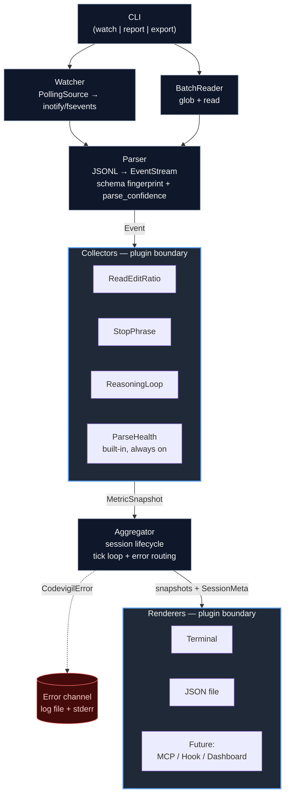

# codevigil — System Design

## Problem

Claude Code session quality degrades silently. Users have no instrumentation to detect, measure, or respond to quality regressions in real-time. The only existing approach (stellaraccident's manual JSONL analysis) required months of logs and significant engineering effort to produce after-the-fact.

codevigil makes session quality observable.

## Non-Goals (v0.1)

- Auto-remediation (hooks that inject corrections)
- Convention drift scoring (requires CLAUDE.md parsing + edit diffing)
- GUI / web dashboard
- Cloud telemetry or any network calls
- Multi-user or team features

## Architecture



### Why This Shape

Two plugin boundaries. Collectors and renderers are the two axes of future expansion. New metric = new collector, no existing code touched. New output target = new renderer, same deal. The parser-to-collector interface (Event) and the collector-to-renderer interface (Snapshot) are the two contracts that need to stay stable.

## Core Abstractions

### Event

The parser's output. Every JSONL entry becomes one or more typed Events. This is the internal lingua franca — collectors never touch raw JSONL.

```python
@dataclass(frozen=True, slots=True)
class Event:
    timestamp: datetime
    session_id: str
    kind: EventKind
    payload: dict[str, Any]

class EventKind(Enum):
    TOOL_CALL = "tool_call"          # any tool invocation
    TOOL_RESULT = "tool_result"      # tool response
    ASSISTANT_MESSAGE = "assistant"  # model text output
    USER_MESSAGE = "user"            # user prompt
    THINKING = "thinking"            # thinking block (content or redacted)
    SYSTEM = "system"                # system/meta events
```

Payload is intentionally unstructured at the type level — each EventKind has an **explicit documented schema** (below) but we don't enforce it with dataclasses to avoid a type explosion as kinds grow. Collectors never reach into `payload` directly; they use the `safe_get` helper in `types.py`:

```python
def safe_get(payload: dict, key: str, default: Any, expected: type | None = None) -> Any:
    """Returns payload[key] if present and type-matches, else default. Logs a WARN
    to the error channel on missing-expected or type-mismatch so drift is observable."""
```

This turns every silent `KeyError` or type mismatch into a counted, reportable event (see **Error Taxonomy**). A collector that starts seeing >5% `safe_get` miss-rate on a required field is a parse-drift signal — surfaced via the `parse_confidence` meta-metric.

#### Payload Schemas by EventKind

| EventKind           | Required keys                                       | Optional keys                                                                                                                                               |
| ------------------- | --------------------------------------------------- | ----------------------------------------------------------------------------------------------------------------------------------------------------------- |
| `TOOL_CALL`         | `tool_name: str`, `tool_use_id: str`, `input: dict` | `file_path: str` (extracted from input when applicable)                                                                                                     |
| `TOOL_RESULT`       | `tool_use_id: str`, `is_error: bool`                | `output: str`, `truncated: bool`                                                                                                                            |
| `ASSISTANT_MESSAGE` | `text: str`                                         | `token_count: int`                                                                                                                                          |
| `USER_MESSAGE`      | `text: str`                                         | —                                                                                                                                                           |
| `THINKING`          | `length: int`                                       | `signature: str`, `redacted: bool`, `text: str` (reserved for v0.2 `thinking_depth` collector; always populated when available, ignored by v0.1 collectors) |
| `SYSTEM`            | `subkind: str`                                      | arbitrary                                                                                                                                                   |

Reserving the `THINKING` payload now (even though v0.1 ships no collector that reads it) avoids a schema migration when `thinking_depth` lands in v0.2.

Trade-off: we lose compile-time payload validation. Acceptable at this scale. If payload diversity grows past ~10 kinds, introduce typed payload dataclasses behind a discriminated union.

### Collector (Protocol)

```python
class Collector(Protocol):
    name: str
    complexity: str  # documented big-O per ingest, e.g. "O(1)" or "O(phrases * text_len)"

    def ingest(self, event: Event) -> None:
        """Process a single event. Must not raise; must not block."""
        ...

    def snapshot(self) -> MetricSnapshot:
        """Return current state. Idempotent and cheap; safe to call at any frequency."""
        ...

    def reset(self) -> None:
        """Clear state. Called ONLY on session boundary transitions (see lifecycle below)."""
        ...
```

Collectors are stateful, single-threaded, and own their windowing logic. The aggregator calls `snapshot()` on a timer or on-demand — collectors don't decide when to report.

#### Lifecycle Contract

`reset()` is called by the aggregator **only** at session boundaries:

1. When a new session file is first observed (fresh collector instance, `reset()` is a no-op but defined for symmetry).
2. When a session is evicted from the active set (see **Stale Session Policy**).
3. Never mid-session. Rolling windows (e.g., `read_edit_ratio`'s 50-event deque) MUST NOT be cleared by `snapshot()` or by tick cadence — doing so would mask the degradation the metric is designed to detect.

Collectors that need per-session state use one instance per session; the aggregator manages the `dict[session_id, dict[collector_name, Collector]]` map.

#### Complexity Honesty

The earlier draft claimed "O(1) amortized" for all collectors. That's false for text-scanning collectors. The real contract:

| Collector         | Per-ingest cost                                                                                                                                     |
| ----------------- | --------------------------------------------------------------------------------------------------------------------------------------------------- |
| `read_edit_ratio` | O(1) — deque append + counter update                                                                                                                |
| `stop_phrase`     | O(P·L) with P = phrase count, L = message length. Switches to Aho–Corasick automaton (stdlib-implementable) once P > 32 to bound to O(L + matches). |
| `reasoning_loop`  | O(P·L) with same escalation rule                                                                                                                    |
| `blind_edit_rate` | O(W) with W = lookback window size (default 20)                                                                                                     |

Document the throughput ceiling in the README: at P=50, L=2000, the naive scan is ~5M char-compares per session of 50 assistant messages — well under a second, but not O(1). The Aho–Corasick escalation is the upgrade path if user phrase lists grow large.

Each collector declares its `name` as a string key. Snapshots are keyed by this name in the aggregated output. Collision is caught at registry load time (see **Registry Validation**), not runtime.

### MetricSnapshot

```python
@dataclass(frozen=True, slots=True)
class MetricSnapshot:
    name: str
    value: float                           # primary scalar (for threshold checks)
    label: str                             # human-readable summary, e.g. "R:E 3.2"
    detail: dict[str, Any] | None = None   # optional structured breakdown
    severity: Severity = Severity.OK

class Severity(Enum):
    OK = "ok"
    WARN = "warn"
    CRITICAL = "critical"
```

`value` is always a float. This is a deliberate constraint — it forces every metric to have a single primary scalar that can be thresholded, trended, and compared. Rich data goes in `detail`.

`severity` is computed by the collector against its own configured thresholds. The renderer uses it for coloring/alerting but doesn't interpret the value itself.

### SessionMeta

```python
@dataclass(frozen=True, slots=True)
class SessionMeta:
    session_id: str          # file stem (see Session Identification)
    project_hash: str        # parent dir name under ~/.claude/projects
    project_name: str | None # resolved via ProjectRegistry; None if unmapped
    file_path: Path
    start_time: datetime     # first event timestamp observed
    last_event_time: datetime
    event_count: int
    parse_confidence: float  # 0.0–1.0, emitted by parser (see Parser Design)
    state: SessionState      # ACTIVE | STALE | EVICTED
```

SessionMeta is produced by the aggregator, not by collectors. It accompanies every render call so renderers never need to reach back into the event stream or filesystem.

### Renderer (Protocol)

```python
class Renderer(Protocol):
    name: str

    def render(self, snapshots: list[MetricSnapshot], meta: SessionMeta) -> None:
        """Output the current state. Called on aggregator tick. Must not raise."""
        ...

    def render_error(self, err: CodevigilError, meta: SessionMeta | None) -> None:
        """Surface an error from parser/watcher/collector. See Error Taxonomy."""
        ...

    def close(self) -> None:
        """Flush any buffered output. Called on CLI exit or session eviction."""
        ...
```

Renderers are stateless w.r.t. metric values but may hold output handles (file descriptors, terminal state). They receive the full snapshot list for a single session on every tick. Multi-session composition is the aggregator's job, not the renderer's — this keeps renderers simple and composable.

Terminal renderer clears and redraws (see **Watch Mode UX Limitations**). JSON renderer appends NDJSON to a rotating file. Future MCP renderer pushes to a local server.

## Module Layout

```text
codevigil/
├── __init__.py              # installs privacy import hook
├── __main__.py              # CLI entrypoint
├── cli.py                   # argparse, mode dispatch
├── parser.py                # JSONL → Event stream, schema fingerprints
├── watcher.py               # Source protocol + PollingSource
├── aggregator.py            # collector orchestration, session lifecycle, error routing
├── errors.py                # CodevigilError hierarchy, ErrorLevel, log writer
├── privacy.py               # import allowlist hook, path scope checks
├── registry.py              # shared collector/renderer registry validation
├── projects.py              # ProjectRegistry (hash → name resolution)
├── types.py                 # Event, EventKind, MetricSnapshot, Severity,
│                            #   SessionMeta, SessionState, safe_get helper
├── collectors/
│   ├── __init__.py           # collector registry
│   ├── parse_health.py       # built-in, always enabled
│   ├── read_edit_ratio.py
│   ├── stop_phrase.py
│   └── reasoning_loop.py
├── renderers/
│   ├── __init__.py           # renderer registry
│   ├── terminal.py
│   └── json_file.py
└── config.py                # TOML loader, precedence resolution, validation
```

### Why Flat Packages

`collectors/` and `renderers/` are the only subdirectories. Everything else is top-level. This keeps import paths short and avoids premature layering. If we later need `sources/` (for non-JSONL inputs) or `hooks/` (for Claude Code hook integration), they slot in at the same level.

### Registry Pattern

Both `collectors/__init__.py` and `renderers/__init__.py` export a registry dict built by scanning the package. Adding a new collector = add a file + add one entry to the registry. No wiring code elsewhere.

```python
# collectors/__init__.py
COLLECTORS: dict[str, type[Collector]] = {
    "read_edit_ratio": ReadEditRatioCollector,
    "stop_phrase": StopPhraseCollector,
    "reasoning_loop": ReasoningLoopCollector,
}
```

Config enables/disables collectors by name. Unknown names in config are errors, not silently ignored.

